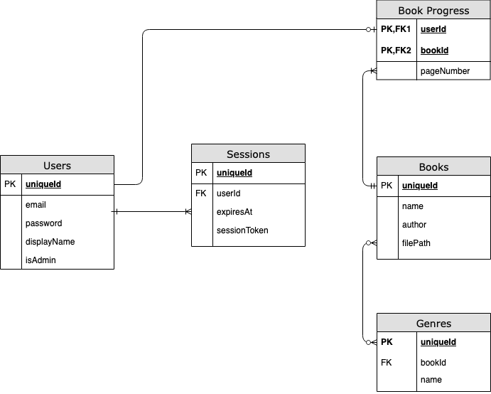

# 00000 - Use SQLite

## Abstract

While we are predominantly serving files on the filesystem, we do need to store data regarding access, progress (page number, bookmarks, etc), and metadata about the books/comics that are being stored. 

## Context and Problem Statement

Dust follows a model similar to Plex. We crawl the file system at the provided Drive/Directory and find books and comics to make available via streaming. However, there are other features of the service that require storing data, and for simplicity in querying and management, we prefer to do that in a database.

## Considered Options

- Postgres
- SQLite
- DenoKV

## Decision Outcome

Since we are trying to keep Dust simple to ship and simple to run, we'd like to use a Database that does not require a standalone server or service. This leaves us with a couple of interesting options, but given the level of support for those options, the clear winner is SQLite.

<!-- Add additional information here, comparison of options, research, etc -->

### Table Structure

